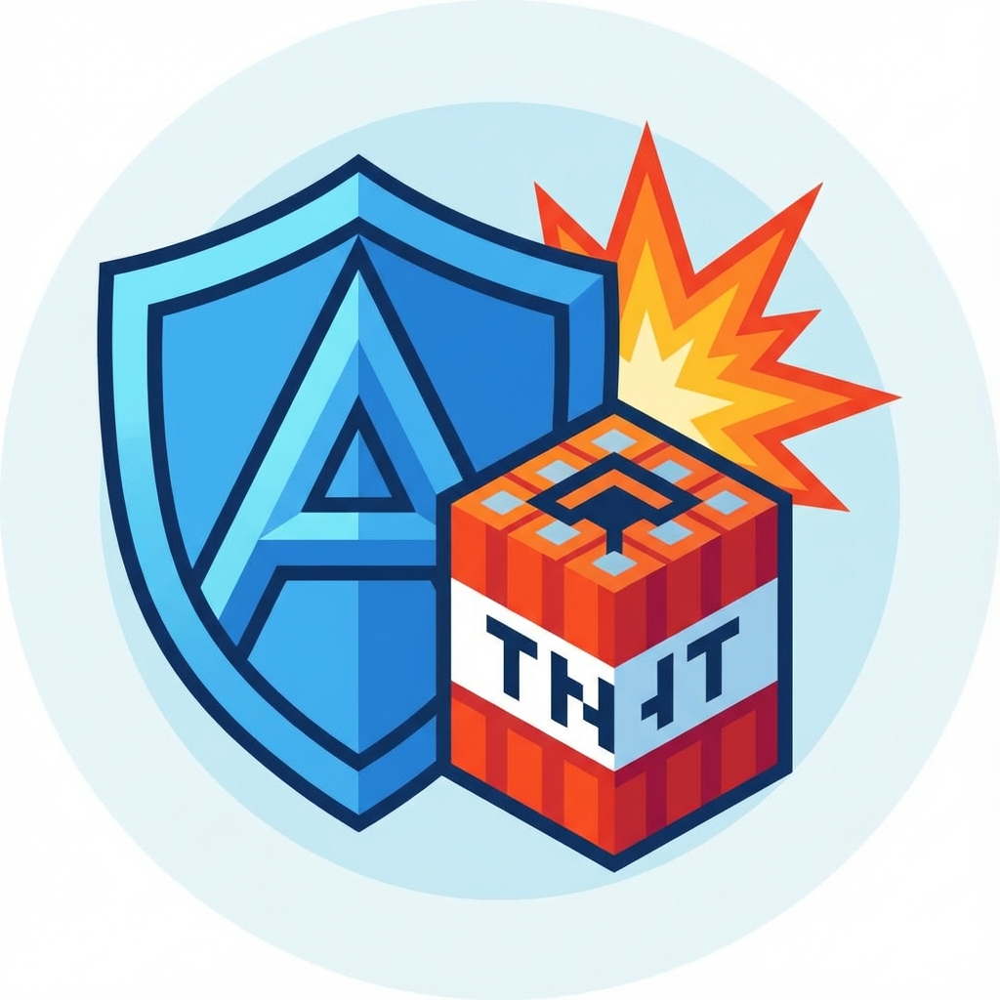

<div align="center">
  
  <h1>AntiBombs Minecraft Plugin</h1>
</div>

## Overview

**AntiBombs** is a lightweight Minecraft server plugin built for Paper 1.21.10 that prevents all terrain damage caused by explosions. It works by listening to the `EntityExplodeEvent` (and related explosion events) and cancelling them, ensuring that blocks are never destroyed by TNT, creepers, ghasts, or any other source of explosions.

## Features

- **Zero terrain damage**: All block‑breaking explosions are cancelled.
- **Compatibility**: Works with Paper API `1.21.10‑R0.1` and should be compatible with any server running this version.
- **Simple configuration**: No configuration files needed – the plugin works out of the box.
- **Lightweight**: Minimal performance impact; only a single event listener.

## Installation

1. Download the compiled `AntiBombs.jar` from the releases page (or build it yourself – see the _Building_ section).
2. Place the JAR file into your server's `plugins/` directory.
3. Restart or reload the server.
4. The plugin will automatically start protecting terrain from explosions.

## Building from Source

The project uses Gradle with Kotlin DSL.

```bash
# Clone the repository
git clone https://github.com/yourusername/AntiBombs.git
cd AntiBombs

# Build the plugin
./gradlew build
```

The compiled JAR will be located at `build/libs/AntiBombs-<version>.jar`.

## Usage

The plugin does not expose any commands or configuration options. Once installed, it will automatically cancel any explosion events that would affect blocks.

If you need to temporarily disable the protection (e.g., for testing), you can unload the plugin with a plugin manager such as `/plugman unload AntiBombs` and reload it later.

## License

This project is licensed under the MIT License – see the `LICENSE` file for details.

## Contributing

Contributions are welcome! Feel free to open issues or submit pull requests for bug fixes, performance improvements, or additional features (e.g., whitelist certain explosions).
